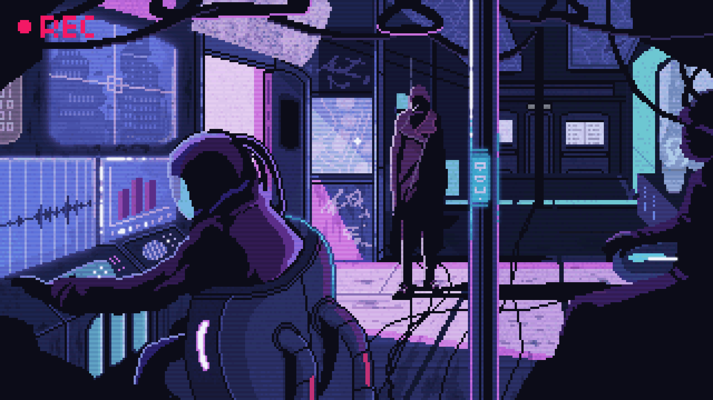

 

 

---

## About Me

I am **Aranda Ilham Zubair**, an Electrical Engineering student based in Jakarta, Indonesia. My work focuses on designing intelligent systems that connect hardware, software, data, and business needs.

I build and explore solutions across **Internet of Things (IoT)**, **embedded systems**, **AI-driven platforms**, automation, sensor integration, and digital innovation for real-world applications.

- Portfolio: [arndilhmzbr.engineer](https://arndilhmzbr.engineer/)
- Location: Jakarta, Indonesia
- Email: [admin@arndilhmzbr.engineer](mailto:admin@arndilhmzbr.engineer)
- Status: Open to collaboration and project work

---

## Technical Focus

<table>
  <tr>
    <td width="50%" valign="top">
      <h3>IoT &amp; Embedded Systems</h3>
      
Microcontroller-based systems, sensor networks, MQTT workflows, firmware prototyping, and hardware-software integration.

    </td>
    <td width="50%" valign="top">
      <h3>AI &amp; Intelligent Systems</h3>
      
Machine learning fundamentals, data processing, automation, pattern recognition, and AI-assisted engineering platforms.

    </td>
  </tr>
  <tr>
    <td width="50%" valign="top">
      <h3>Digital Platforms</h3>
      
Web dashboards, database-backed applications, system interfaces, and tools that support operational workflows.

    </td>
    <td width="50%" valign="top">
      <h3>Innovation &amp; Research</h3>
      
Technology entrepreneurship, patents, publications, educational initiatives, and applied engineering research.

    </td>
  </tr>
</table>

---

## Tech Stack

**Languages**

 

**Frameworks, Tools & Platforms**

 

**Engineering & Hardware**

---

## Highlight Areas

<table>
  <tr>
    <td align="center" width="25%">
      
    </td>
    <td align="center" width="25%">
      
    </td>
    <td align="center" width="25%">
      
    </td>
    <td align="center" width="25%">
      
    </td>
  </tr>
</table>

---

## Featured Work

- **IoT Weather Monitoring Station (IWEMS)**: IoT-based weather monitoring concept and patent work.
- **Digital Fence System for National Park Protection**: Smart protection system concept for monitored conservation areas.
- **Vision-to-Sound Object Recognition System**: Augmented reality-based assistive technology research for visually impaired users.
- **Pesantren Digital Platforms**: Information system and LMS initiatives for educational operations.

More details are available on my portfolio: [arndilhmzbr.engineer](https://arndilhmzbr.engineer/#projects)

---

## GitHub Stats

 

<table width="100%" border="0" cellspacing="0" cellpadding="6">
  <tr>
    <td width="50%" align="center">
      
    </td>
    <td width="50%" align="center">
      
    </td>
  </tr>
  <tr>
    <td width="50%" align="center">
      
    </td>
    <td width="50%" align="center">
      
    </td>
  </tr>
</table>

---

## 3D Contribution

 

---

## Profile Summary

 

 

 

---

## Connect

 

---

  <picture>
    <source media="(prefers-color-scheme: dark)" srcset="https://raw.githubusercontent.com/yaelahaiz/yaelahaiz/output/github-contribution-grid-snake-dark.svg">
    <source media="(prefers-color-scheme: light)" srcset="https://raw.githubusercontent.com/yaelahaiz/yaelahaiz/output/github-contribution-grid-snake.svg">
    
  </picture>

